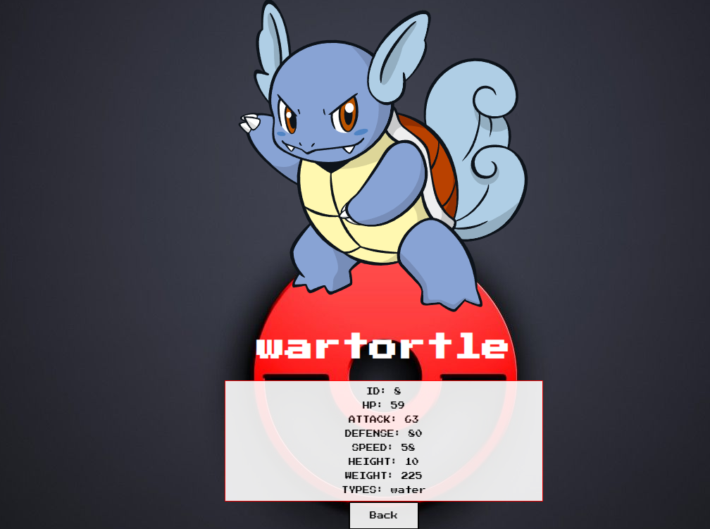

# Pokedex Project

  

## Features

- Front using react
- backend with node
- conneccion a API de Pokemon, guarda los pokemon originales y es capaz de crear y guardar nuevos pokemon en la base de datos
- funciones de busqueda y filtrado
- manual CSS

#### Frontend rutas y contenido

__Pagina inicial__:
- Imagen de fondo representativa al proyecto
- Botón para ingresar al home (`Ruta principal`)

  

__Ruta principal__:
- Input de búsqueda para encontrar pokemons por nombre (La búsqueda será exacta, es decir solo encontrará al pokemon si se coloca el nombre completo)
- Área donde se verá el listado de pokemons. y muestra su:
  - Imagen
  - Nombre
  - Tipos (Electrico, Fuego, Agua, etc)
- Botones/Opciones para filtrar por tipo de pokemon y por pokemon existente o creado por nosotros
- Botones/Opciones para ordenar tanto ascendentemente como descendentemente los pokemons por orden alfabético y por fuerza
- Paginado para ir buscando y mostrando los siguientes pokemons, 12 pokemons por pagina.

  

__Ruta de detalle de Pokemon__: contiene
- Los campos mostrados en la ruta principal para cada pokemon (imagen, nombre y tipos)
- Número de Pokemon (id)
- Estadísticas (vida, fuerza, defensa, velocidad)
- Altura y peso

  

__Ruta de creación__: contiene
- Un formulario __controlado con JavaScript__ con los campos mencionados en el detalle del Pokemon
- Posibilidad de seleccionar/agregar más de un tipo de Pokemon
- Botón/Opción para crear un nuevo Pokemon

  

#### Base de datos

El modelo en la base de datos contiene lo siguiente:

- Pokemon con las siguientes propiedades:
  - ID (Número de Pokemon) * : No puede ser un ID de un pokemon ya existente en la API pokeapi
  - Nombre *
  - Vida
  - Fuerza
  - Defensa
  - Velocidad
  - Altura
  - Peso
- Tipo con las siguientes propiedades:
  - ID
  - Nombre

#### Backend

desarrollado con node/express:

- __GET /pokemons__:
  - Obtener un listado de los pokemons desde pokeapi.
  - Debe devolver solo los datos necesarios para la ruta principal
-  __GET /pokemons/{idPokemon}__:
  - Obtener el detalle de un pokemon en particular
  - Debe traer solo los datos pedidos en la ruta de detalle de pokemon
  - Tener en cuenta que tiene que funcionar tanto para un id de un pokemon existente en pokeapi o uno creado por ustedes
-  __GET /pokemons?name="..."__:
  - Obtener el pokemon que coincida exactamente con el nombre pasado como query parameter (Puede ser de pokeapi o creado por nosotros)
  - Si no existe ningún pokemon mostrar un mensaje adecuado
-  __POST /pokemons__:
  - Recibe los datos recolectados desde el formulario controlado de la ruta de creación de pokemons por body
  - Crea un pokemon en la base de datos
-  __GET /types__:
  - Obtener todos los tipos de pokemons posibles
  - En una primera instancia deberán traerlos desde pokeapi y guardarlos en su propia base de datos y luego ya utilizarlos desde allí

